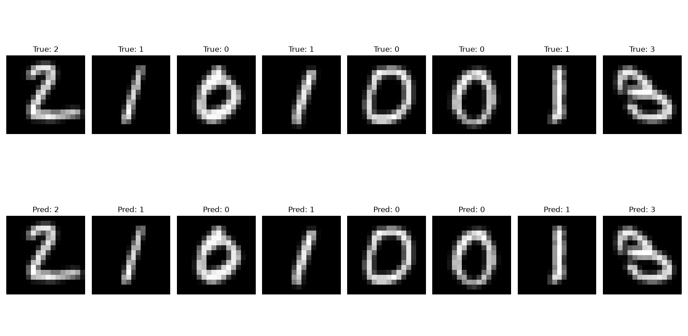

# Hybrid QCNN for Classification of Edge-Enhanced Images

A hybrid quantum-classical convolutional neural network (QCNN) for digit classification on MNIST data set, with it **achieving 91.5% accuracy** on a 4-class (digits 0-3) subset. The model combines a parameterized quantum circuit (acting as a "quantum convolution" over 2×2 image patches) with a classical fully-connected head, and supports training on either raw pixel intensities or Canny edge maps.

## Overview

Each 16×16 grayscale input image is divided into non-overlapping 2×2 patches. Every patch (4 pixel values) is angle-encoded into a 4-qubit quantum circuit, processed through entangling layers, and measured to produce 4 expectation values per patch. These quantum-derived feature maps are then pooled and passed through a small classical MLP for final classification.

```
Input image (16x16)
      │
      ▼
2x2 patch extraction
      │
      ▼
Angle Embedding (RY) -> 4 qubits
      │
      ▼
Basic Entangling Layers (depth=2)
      │
      ▼
Pauli-Z expectation values (4 per patch)
      │
      ▼
Reassemble into 8x8x4 feature map
      │
      ▼
Adaptive Average Pooling (4x4)
      │
      ▼
Fully Connected (64) -> ReLU -> Dropout
      │
      ▼
Fully Connected (n_classes)
```

## Project Structure

```
.
├── models/
│   ├── hybrid_model.py      # HybridQCNN: quantum + classical architecture
│   ├── quantum_circuit.py   # PennyLane circuit definition (AngleEmbedding + BasicEntanglerLayers)
│   └── quantum_layer.py      # TorchLayer wrapper for the quantum circuit
├── utils/
│   ├── dataset.py            # MNIST loading, class filtering, edge map generation
│   └── visualization.py      # Prediction visualization utilities
├── train.py                  # Training script
├── evaluate.py                # Evaluation / visualization script
├── requirements.txt
└── checkpoints/               # Saved model weights (created during training)
```

## Setup

```bash
pip install -r requirements.txt
```

**Dependencies:** PennyLane (with Lightning simulator), PyTorch, torchvision, NumPy, Matplotlib, scikit-image, OpenCV, tqdm.

## Usage

### Training

```bash
python train.py
```

Configuration options in `train.py`:

| Parameter     | Description                                             | Default        |
| ------------- | ------------------------------------------------------- | -------------- |
| `USE_EDGES`   | Train on Canny edge maps instead of raw pixels          | `False`        |
| `SUBSET_SIZE` | Number of training samples (set `None` for full 60,000) | `3000`         |
| `N_EPOCHS`    | Number of training epochs                               | `10`           |
| `BATCH_SIZE`  | Batch size                                              | `32`           |
| `LR`          | Learning rate (Adam)                                    | `0.01`         |
| `CLASSES`     | Digit classes to classify                               | `[0, 1, 2, 3]` |

Model checkpoints are saved to `checkpoints/epoch_N.pth` after each epoch.

### Evaluation

```bash
python evaluate.py
```

Loads a trained checkpoint and displays a grid of sample predictions versus ground truth labels.

<!-- > **Note:** Keep `USE_EDGES`, `CHECKPOINT`, `BATCH_SIZE`, and `CLASSES` in `evaluate.py` consistent with the settings used in `train.py`. -->

## Model Details

- **Input size:** 16×16 grayscale images (resized from MNIST's 28×28), normalized to `[-1, 1]`
- **Quantum circuit:** 4 qubits (one per pixel in a 2×2 patch), `AngleEmbedding` (Y-rotation) + 2 layers of `BasicEntanglerLayers`, simulated with `lightning.qubit`
- **Quantum layer:** Implemented as a `qml.qnn.TorchLayer`, batched across all patches for efficiency
- **Classical head:** Adaptive average pooling (4×4) → Flatten → FC(64) → ReLU → Dropout(0.3) → FC(n_classes)

## Edge-Enhanced Mode

Setting `USE_EDGES=True` (in both `train.py` and `evaluate.py`) replaces raw pixel inputs with Canny edge maps, computed via `skimage.feature.canny` and rescaled to `[-1, 1]` to match the angle-encoding range.

## Results

Training on 4 classes (digits 0–3) with a 3,000-sample subset for 10 epochs:

| Epoch | Loss   | Accuracy |
| ----- | ------ | -------- |
| 1     | 0.7456 | 0.7193   |
| 2     | 0.3534 | 0.8787   |
| 3     | 0.3115 | 0.8900   |
| 4     | 0.2995 | 0.8940   |
| 5     | 0.2717 | 0.9040   |
| 6     | 0.2736 | 0.9017   |
| 7     | 0.2683 | 0.9030   |
| 8     | 0.2401 | 0.9153   |
| 9     | 0.2517 | 0.9140   |
| 10    | 0.2433 | 0.9117   |

Sample predictions on the test set:



<!-- ## License -->
